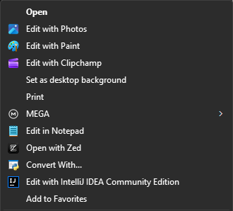
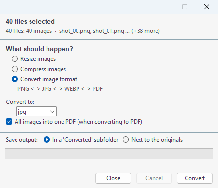
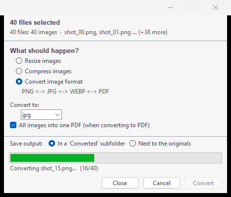
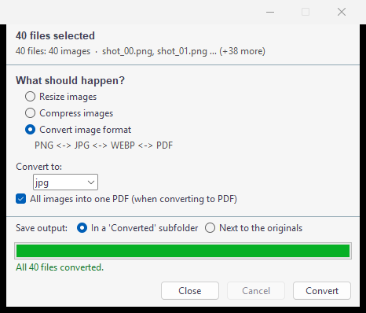
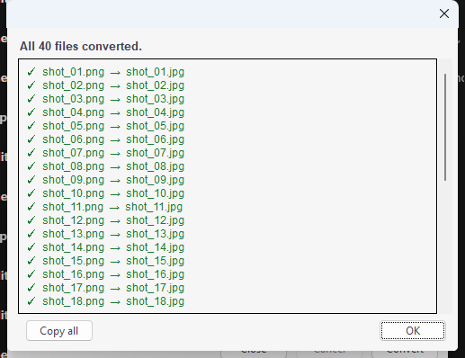

# Universal Convert

A **Convert With...** entry in your right-click menu. Select a file (or fifty),
pick what you want, it does the thing.

I got tired of opening a full editor just to shrink a photo or glue two PDFs
together, so this exists now.

## Download

Pre-built packages are on the
[Releases page](https://github.com/harmless-beep/universal-convert/releases)
- no Python required:

| Platform | Grab this | What you get |
| --- | --- | --- |
| Windows | `Universal-Convert-<ver>-windows.exe` | one file, double-click it |
| Windows (CLI) | `Universal-Convert-<ver>-windows-cli.exe` | same build with a console, for the command-line examples below |
| macOS | `Universal-Convert-<ver>-macos.dmg` | open it, drag the app into Applications |
| Linux | `Universal-Convert-<ver>-linux-x86_64.AppImage` | `chmod +x` it, then double-click (a plain `.tar.gz` if AppImage tooling is missing) |

Every package is built and smoke tested in CI - the packaged binary has to
convert a real image before it gets attached - and `SHA256SUMS.txt` sits in
the release next to them.

Double-clicking the app with no files selected opens a file picker, so the
download is usable on its own. The right-click menu entry is separate
(`installers/` below), since registering a menu is the part a lone executable
cannot do for itself.

## What it handles

**Images** (jpg, jpeg, png, webp, gif, bmp, tiff)

- resize to exact pixels, a percentage, or a preset (Web-1920, Email-1024,
  Print-A4@300, Thumbnail-256, all editable in the config)
- compress with a quality slider, or auto-optimize toward a target file size
- convert between png / jpg / webp, one file each or everything merged into a
  single PDF

**PDFs**

- export pages as PNG or JPG at 96 / 150 / 300 dpi
- convert to DOCX (best effort, see the complaints section)
- compress, either lossless or by re-rendering
- merge two or more, or split by page ranges like `1-3,5`

**Office docs** (docx, pptx, xlsx, plus the older doc/xls/odp/odt/ods)

- to PDF through LibreOffice headless, so no Microsoft Office required
- pptx to one PNG per slide, zipped up

Everything batches. Select 50 files and you get one dialog, one progress bar
and a per-file result list. A corrupt file fails on its own and the rest keep
going.

## Install

**Windows**

```
powershell -ExecutionPolicy Bypass -File installers/windows.ps1
```

Right-click a file and look for **Convert With...**. On Windows 11 it sits
under *Show more options* (or Shift+F10), which is just how regular menu
entries work there, not a bug.

**macOS**

```
bash installers/macos.sh
```

Appears under Finder → right-click → Quick Actions. If it doesn't show up,
check System Settings → Privacy & Security → Extensions → Finder and switch it
on.

**Linux**

```
bash installers/linux.sh
```

Nautilus puts it under right-click → Scripts, Dolphin shows it directly on
right-click. Run `nautilus -q` afterwards if GNOME hasn't picked it up yet.

The installers check your Python, `pip install Pillow pypdf PyMuPDF`, and
register the menu entry for the current user only, so no admin or sudo. Every
one of them takes `--uninstall` / `-Uninstall` and keeps your config files.

You need Python 3.9+ with tkinter. LibreOffice is only needed for Office
document conversions, images and PDFs work fine without it.

## Using it

Screenshots are from Windows, because that's what I had to take pictures of.
The other platforms work the same way, just wherever their menu puts it.

1. Select your files, right-click one of them, pick **Convert With...**

   

2. One dialog for the whole batch. Pick what should happen, pick where the
   output lands - it shows you the exact folder before anything is written,
   or send it somewhere else entirely - hit Convert. Here it's a folder of
   40 PNGs going to JPG.

   

3. It works through them one at a time, telling you which file it's on and
   how far along you are. Changed your mind? **Cancel** stops it after the
   file it's already doing.

   

4. When the bar fills up, the status line goes green.

   

5. Then you get a per-file list - every file, in your own order, with the
   output name next to it. If something didn't work out you see the actual
   reason on that line instead of a bare ✗, plus an **Open log** button for
   the full story and **Copy all** if you just want the list.

   

If a file is broken it fails on its own and the rest keep going.

## How it works (the one clever bit)

Windows Explorer launches a separate process for *each* selected file, which
would normally mean one dialog per file. `platform_util/aggregate.py` works
around it: first process to arrive elects itself the owner, the others dump
their file paths into a lock-protected queue file and exit, and after a short
debounce the owner opens a single dialog for the whole selection. Pure stdlib,
no helper executables. macOS and Linux pass everything in one invocation so
they never needed this.

## Command line

The dialog is the everyday interface but nothing is trapped behind it:

```bash
python main.py --info photo.jpg                          # what actions apply?
python main.py --cli --action resize --width 800 photo.jpg
python main.py --cli --action compress --auto-optimize --quality 85 *.png
python main.py --cli --action convert --format pdf a.png b.png
python main.py --cli --action pdf_split --ranges 1-3,5 doc.pdf
python main.py --cli --action pdf_merge a.pdf b.pdf
python main.py --cli --action office_to_pdf report.docx
python main.py --cli --action pptx_to_images deck.pptx
```

## Settings

Plain JSON, edit it however you like:

- Windows: `%APPDATA%\UniversalConvert\settings.json`
- macOS: `~/Library/Application Support/UniversalConvert/settings.json`
- Linux: `~/.config/universal-convert/settings.json`

Everything in there is optional, delete the file to go back to defaults.
Presets take a plain number (long edge in pixels) or a paper spec like
`"A4@300"`.

## Complaints department

- **PDF → DOCX** is best effort by nature. LibreOffice gets first shot at
  rebuilding the layout, and if that fails you get a text-only DOCX. Scanned
  PDFs contain no text at all, so there's nothing to extract.
- **PNG compression is lossless**, meaning files only get so much smaller. If
  size is the actual goal, convert to JPG or WEBP instead.
- LibreOffice output quality varies by document. Password-protected files
  refuse with a friendly message rather than crashing.
- The macOS and Linux installers are structurally validated (plist parses,
  `bash -n` passes) but I've only run the Windows path end to end. If
  something's broken on your Mac or distro, I'd like to hear about it.

## Development

```bash
python tests/selftest.py     # PASS/FAIL per check, exit code 0 means green
python main.py --probe file  # prints the aggregated selection
```

The tests generate their own fixtures (images, a 3-page PDF, minimal
docx/pptx/xlsx), so there's nothing extra to download first.

Cutting a release - the same steps CI runs when a `v*` tag is pushed:

```bash
python installers/make_icon.py                       # icon art -> .png/.ico/.icns
python installers/build_release.py --version 0.1.0   # build, smoke test, package
```

Do that in an environment holding only `requirements.txt` plus `pyinstaller`.
PyInstaller packs whatever happens to be importable in the current Python, so
in a kitchen-sink environment you get a kitchen-sink binary - the smoke test
in `build_release.py` is what stops a broken or bloated package from being
published.
